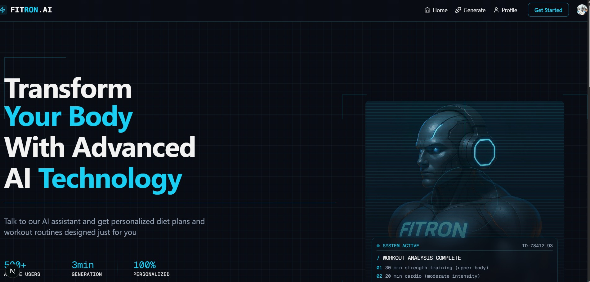

# ⚡ FITRON.AI

<p align="center">
  
</p>

<h3 align="center">FITRON.AI</h3>

<p align="center">
  <strong>A modern, voice-activated fitness AI platform to get jacked for free.</strong>
</p>

<p align="center">
  <a href="#-features">Features</a> •
  <a href="#-tech-stack">Tech Stack</a> •
  <a href="#-project-architecture">Architecture</a> •
  <a href="#%EF%B8%8F-getting-started">Getting Started</a> •
  <a href="#%EF%B8%8F-environment-variables">Configuration</a> •
  <a href="#-convex-backend">Convex Backend</a>
</p>

---

## 🚀 Overview

**FITRON.AI** is a futuristic, highly personalized fitness and nutrition coaching platform. By combining real-time **voice conversations** powered by Vapi AI, structured generation using **Google Gemini 2.0 Flash**, and high-performance serverless state synchronization with **Convex**, FITRON.AI delivers tailored diet and exercise regimes on the fly. 

The entire experience is wrapped in a high-fidelity **Cyberpunk / Sci-Fi visual theme** featuring glowing grid lines, sound-wave animations, active scanlines, and terminal interfaces.

---

## ✨ Features

- 🎙️ **Interactive Voice Assistant**: Have a live, real-time voice conversation with **FITRON AI** (your custom Fitness & Diet Coach) using your microphone to build your profile.
- 🧠 **Gemini-Powered Generation**: Uses the cutting-edge `gemini-2.0-flash-001` model under the hood to compile data and output structured, schemas-validated workout and diet programs.
- 📋 **Personalized Programming**: Automatically generates:
  - **Workout Schedules**: Custom training splits (days, routines, sets, reps, and target focuses) adjusted for injuries/limitations.
  - **Diet Plans**: Calculated daily calorie goals and dynamic meal breakdowns (breakfast, lunch, dinner, snacks) built around dietary restrictions.
- 🎛️ **Futuristic Dashboard**: Inspect, manage, and toggle between your current active and historical fitness plans via a clean, high-tech interface utilizing Radix tabs, accordions, and custom glow vectors.
- 🔐 **Clerk Authentication & Webhooks**: Seamless onboarding and real-time user database synchronization via robust Clerk-to-Convex Svix webhook integrations.

---

## 🛠️ Tech Stack

### Frontend
- **Framework**: [Next.js 15](https://nextjs.org/) (App Router, Turbopack enabled)
- **Library**: [React 19](https://react.dev/)
- **Authentication**: [Clerk Next.js SDK](https://clerk.com/)
- **Voice SDK**: [@vapi-ai/web](https://vapi.ai/) for real-time voice streaming and event handling

### Backend & Database
- **Database**: [Convex](https://www.convex.dev/) (Real-time document store, transactional serverless functions)
- **AI Orchestration**: [@google/generative-ai](https://ai.google.dev/) (Gemini 2.0 Flash)
- **Security**: [Svix](https://www.svix.com/) for cryptographic verification of incoming Clerk webhooks

### Styling & Aesthetics
- **CSS Engine**: [Tailwind CSS v4](https://tailwindcss.com/)
- **Theme**: Cyberpunk-dark configuration (`--cyber-blue-bright`, `--cyber-dark`, scanlines, sound-waves)
- **Icons**: [Lucide React](https://lucide.dev/)
- **Transitions**: [tw-animate-css](https://www.npmjs.com/package/tw-animate-css)

---

## 📐 Project Architecture

```
fit-app/
├── convex/                   # Convex Backend-as-a-Service Schema & Actions
│   ├── _generated/           # Auto-generated Convex client bindings
│   ├── auth.config.ts        # Convex auth configuration
│   ├── http.ts               # Webhooks (Clerk) & HTTP endpoints (Vapi API Integration)
│   ├── plans.ts              # Plan mutation & query schemas
│   ├── schema.ts             # Database schema (users & plans tables)
│   └── users.ts              # User mutation & query schemas
├── src/
│   ├── app/                  # Next.js App Router pages
│   │   ├── (auth)/           # Authentication routes (Sign-in/Sign-up)
│   │   ├── generate-program/ # Voice-activation & conversation page
│   │   ├── profile/          # User Dashboard displaying active & past plans
│   │   ├── globals.css       # Tailwind v4 directives & custom Cyberpunk theme styles
│   │   ├── layout.tsx        # Main layout wrapped in ConvexClerkProvider
│   │   └── page.tsx          # Landing / Hero page
│   ├── components/           # UI Elements & Custom Modules
│   │   ├── ui/               # Reusable base components (Card, Button, Accordion, etc.)
│   │   ├── CornerElements.tsx# Neo-brutalist Sci-Fi corner designs
│   │   ├── Navbar.tsx        # Responsive navigation with Clerk auth flows
│   │   ├── ProfileHeader.tsx # Dashboard heading displaying user details
│   │   ├── TerminalOverlay.tsx# Simulated retro command line display
│   │   └── UserPrograms.tsx  # Dynamic gallery showcasing sample & active programs
│   ├── constants/            # Mock dataset & fallback configurations
│   ├── lib/                  # Vapi initialization wrapper & helper scripts
│   └── providers/            # Convex & Clerk context provider wrappers
```

---

## ⚡ Getting Started

### 1. Clone & Install Dependencies
First, open your command terminal in the `fit-app` directory and install all node packages:
```bash
npm install
```

### 2. Configure Local Environment Variables
Create a `.env.local` file in the root of the `fit-app` directory. Add your credentials (see [Environment Variables](#%EF%B8%8F-environment-variables) below for details):
```env
NEXT_PUBLIC_CLERK_PUBLISHABLE_KEY=pk_test_...
CLERK_SECRET_KEY=sk_test_...

NEXT_PUBLIC_CLERK_SIGN_IN_URL=/sign-in
NEXT_PUBLIC_CLERK_SIGN_UP_URL=/sign-up

NEXT_PUBLIC_VAPI_WORKFLOW_ID=your_vapi_workflow_id
NEXT_PUBLIC_VAPI_API_KEY=your_vapi_api_key

CONVEX_DEPLOYMENT=dev:...
NEXT_PUBLIC_CONVEX_URL=https://...convex.cloud
```

### 3. Spin Up Convex Backend
To boot up the Convex development server, synchronize your schemas, and watch for backend changes, run:
```bash
npx convex dev
```
*Note: This command will generate the local folder `convex/_generated` and synchronize your schemas with your Convex cloud deployment.*

### 4. Run the Development Server
In a separate terminal, launch the Next.js development server:
```bash
npm run dev
```

Open [http://localhost:3000](http://localhost:3000) in your web browser to explore the dashboard and start generating fitness programs.

---

## ⚙️ Environment Variables

### Clerk Integration
Create an application inside your [Clerk Dashboard](https://dashboard.clerk.com/) and copy the API keys:
- `NEXT_PUBLIC_CLERK_PUBLISHABLE_KEY`: Public key to authenticate requests from the browser.
- `CLERK_SECRET_KEY`: Secret key used for secure server-side calls.

### Vapi Integration
Sign up at [Vapi AI](https://vapi.ai/) to configure a conversational agent:
- `NEXT_PUBLIC_VAPI_API_KEY`: Your Vapi public key.
- `NEXT_PUBLIC_VAPI_WORKFLOW_ID`: The ID of your configured assistant workflow.

### Convex Integration
Create a project on the [Convex Dashboard](https://dashboard.convex.dev/):
- `CONVEX_DEPLOYMENT`: The unique deployment identifier.
- `NEXT_PUBLIC_CONVEX_URL`: The HTTP URL of your Convex instance.

---

## 🔥 Convex Backend & API Integration

FITRON.AI runs high-performance backend actions inside Convex. The key integration points are defined in `convex/http.ts`:

### 1. Clerk User Webhooks (`/clerk-webhook`)
Whenever a user signs up or updates their profile via Clerk, Clerk emits a webhook to Convex. 
- Convex validates the authenticity of the payload using **Svix** and the `CLERK_WEBHOOK_SECRET` environment variable.
- Upon validation, Convex triggers `api.users.syncUser` or `api.users.updateUser` to sync details (`name`, `email`, `image`, `clerkId`) directly into the real-time database.

### 2. Voice-Activated Generation (`/vapi/generate-program`)
This endpoint is queried during/after the Vapi voice interaction session.
- Receives gathered payload data: `age`, `height`, `weight`, `injuries`, `workout_days`, `fitness_goal`, `fitness_level`, `dietary_restrictions`, `user_id`.
- Utilizes **Gemini 2.0 Flash** with a JSON-constrained response structure to output structured, clean plans.
- Runs verification logic to cast properties like `sets`, `reps`, and `dailyCalories` into integer values.
- Deactivates previous programs for the user by toggling their `isActive` property to `false`, then writes the new program schema to the `plans` database.

> [!IMPORTANT]
> **Convex Dashboard Configuration**:
> Make sure to configure the following environment variables in your **Convex Dashboard Settings** (`Settings > Environment Variables`):
> 1. `GEMINI_API_KEY`: Your Google Generative AI Developer Key (to interact with `gemini-2.0-flash-001`).
> 2. `CLERK_WEBHOOK_SECRET`: The webhook secret provided in the Clerk dashboard (under webhooks).

---

## 🎨 Visual System & Themes

FITRON.AI relies on custom theme values mapped to Tailwind CSS. Key design values include:

| CSS Variable | Color Value | Purpose |
| --- | --- | --- |
| `--background` | `#0a0c14` (Cyber Dark) | Main website theme background |
| `--primary` | `#18cef2` (Bright Neon Cyan) | Action buttons, glowing borders, active indicators |
| `--secondary` | `#1089bd` (Cyber Blue) | Hover states, tab triggers, visual highlights |
| `--border` | `rgba(24, 206, 242, 0.2)` | Glowing thin dividers, border containers |
| `--cyber-terminal-bg` | `rgba(0, 0, 0, 0.7)` | Terminal background panel transparency |

### Micro-Animations
- **Scanlines (`animate-scanline`)**: Transverses the main cover artwork to simulate retro CRT screens.
- **Sound Waves (`animate-sound-wave`)**: Renders custom equalizer bars during the voice interaction phase depending on the assistant's speech state.
- **Slow Spins (`animate-slow-spin`)**: Rotates corner pieces to add movement and futuristic premium feels.

---
